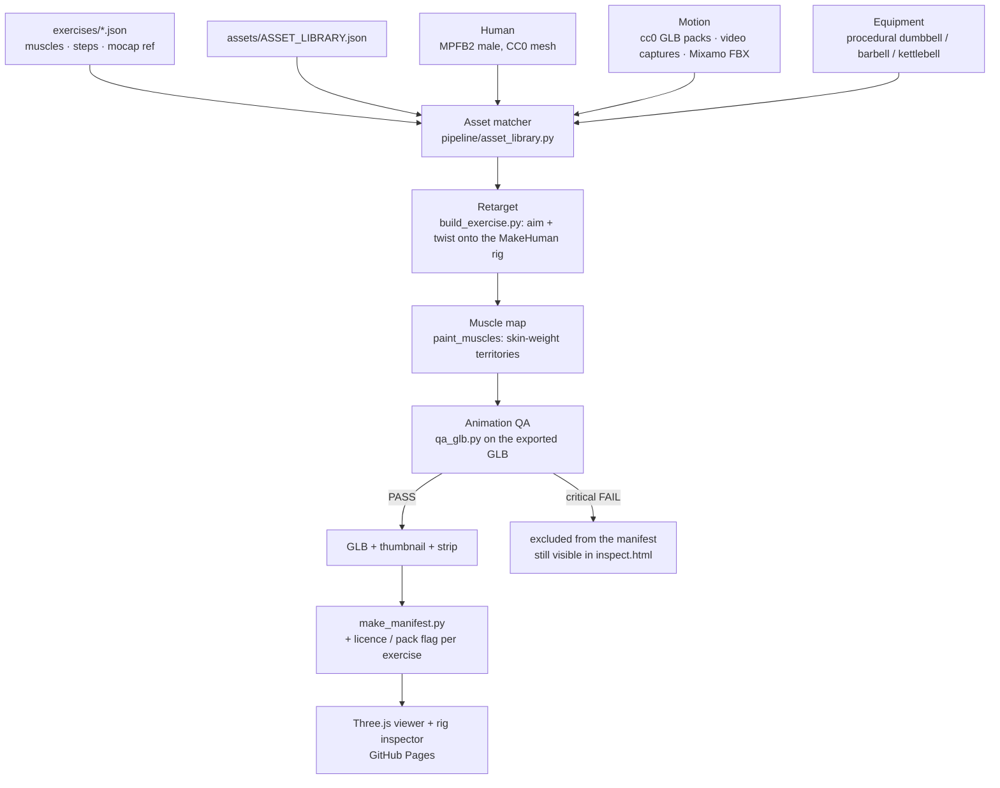

# Asset pipeline — free human, free motion, one GLB per exercise

The renderer has not changed: a spec in `exercises/` still goes through
headless Blender in GitHub Actions and comes out as a skinned, animated GLB
plus a thumbnail, graded by `pipeline/qa_glb.py` and shown by the Three.js
viewer on GitHub Pages. What changed on 2026-09-15 is the layer underneath:
**assets are looked up in a library, not bought**, and the library knows
the licence of every human, motion and implement so the manifest can say
which renders may be sold.



## Stages, inputs, outputs

| Stage | Input | Output | Code |
|---|---|---|---|
| Human | MPFB2 add-on (pinned zip, cached in CI), `gender 1.0`, `muscle 1.0` | MakeHuman default rig + basemesh, helpers stripped | `create_human`, `strip_helpers` |
| Motion source | one of: `mixamo/x.fbx` (private checkout) · `cc0/mesh2motion/pack.glb#Clip` (vendored) · `video/x.json` (from `video_mocap.py`) | `(kind, armature or frames, f0, f1)` | `resolve_mocap`, `load_mocap` |
| Retarget | per-frame world direction + roll reference per driver bone, pelvis rotation, root offset | keyed MakeHuman pose, linear between samples | `animate_mocap` (fbx/glb), `animate_video` (json), `transfer_pose`, `aim_bone` |
| Muscle map | spec `primary` / `secondary` | red/orange materials on the skin territories | `paint_muscles`, `MUSCLE_SPEC` |
| Props | spec `equipment` | procedural implement parented to the hands every frame | `build_props`, `place_props`, `grip_hands` |
| Export | scene | `<id>.glb` (rig + baked clip), `<id>.png`, 240 px frames | `export_scene.gltf` |
| QA | the GLB | `<id>.glb.qa.json`; exit 1 on a critical failure | `qa_glb.py` |
| Manifest | specs + QA reports + asset library | `exercises.json` with `license.pack` per exercise, `qa_report.json` | `make_manifest.py` |
| Inspector | GLB + QA report | skeleton, angles, contacts, front/side/3-4/back/top, CI strip | `website/inspect.html` |

## The three motion lanes

| Lane | Reference in the spec | Where the file lives | Licence | In the pack? |
|---|---|---|---|---|
| CC0 pack | `cc0/mesh2motion/human-addon-animations.glb#Pushup` | `motions/cc0/` (public, vendored, 10 MB) | CC0-1.0 | yes |
| Video capture | `video/lunge.json` | `motions/video/` (public) | yours when you shot it (`own`); `video-demo` for the two test files | yes once it is your footage |
| Mixamo | `mixamo/air_squat.fbx` | private `opengym3d-mocap` checkout | Adobe Mixamo terms | no |

`python3 pipeline/asset_library.py check exercises` prints the lane, licence
and pack flag of every spec; `tests/test_specs.py` fails on a motion the
library does not know.

## Record an exercise yourself (the lane that covers the 18 drafts)

```
# once
uv venv --python 3.12 .venv && uv pip install --python .venv/bin/python \
    mediapipe==0.10.21 opencv-python-headless numpy

# per exercise: phone on a tripod, side view, whole body in frame, one clean rep
.venv/bin/python pipeline/video_mocap.py ~/Downloads/lunge.mov motions/video/lunge.json \
    --auto-rep --source "own capture, iPhone, side view" --license own
```

Then add `"mocap": "video/lunge.json"` to `exercises/lunge.json`, remove
`"status": "draft"`, add the library entry, push. The spike workflow renders
one exercise in ~8 minutes with the QA table and a 12-frame strip in its
artifact; the full render deploys it.

Tips that came out of the first captures (docs/FREE_ASSET_RESEARCH.md has
the measurements): side or 3/4 view beats front-on for depth; keep the feet
in frame the whole rep (hip height is measured from the lowest foot point);
`--auto-rep` trims to the deepest standing→bottom→standing cycle, so a
minute of talking before the rep is fine; `--mirror` for selfie-camera
footage.

## Where things are

```
assets/ASSET_LIBRARY.json      every asset + licence (humans, motions, equipment, references)
motions/cc0/mesh2motion/       162 CC0 clips in two GLB packs + LICENSE-CC0.md
motions/video/                 captures from pipeline/video_mocap.py
pipeline/asset_library.py      search / resolve / check
pipeline/video_mocap.py        phone video -> motion json (local, MediaPipe)
pipeline/build_exercise.py     M2M_MAP, resolve_mocap, load_mocap, animate_video, animate_mocap
pipeline/make_manifest.py      licence + pack flag per exercise
docs/FREE_ASSET_RESEARCH.md    what was evaluated, what was rejected, why
```
